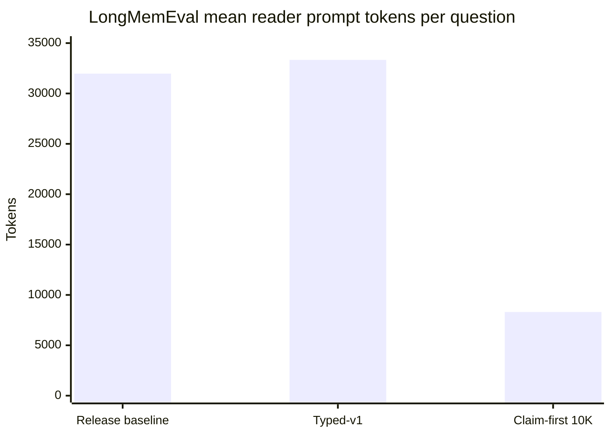
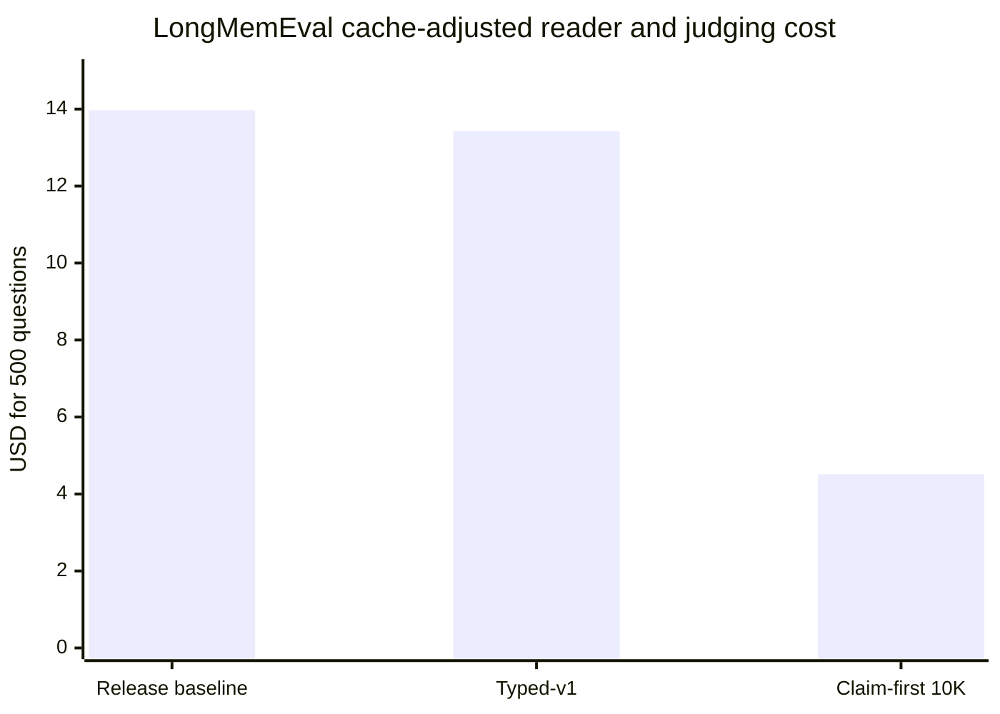
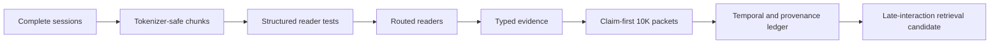

<p align="center">
  
</p>

<h1 align="center">Vault Benchmarks</h1>

<h3 align="center">memory quality, retrieval, and context efficiency</h3>

<p align="center">
  Reproducible evaluation of Vault's conversational-memory pipeline on LongMemEval and LoCoMo.
</p>

<p align="center">
  
  
  
  
</p>

<p align="center">
  <a href="ReadME.md">Overview</a> ·
  <a href="#headline-results">Headline results</a> ·
  <a href="#longmemeval-s">LongMemEval</a> ·
  <a href="#locomo">LoCoMo</a> ·
  <a href="#published-comparison">Comparison</a> ·
  <a href="#reproducibility-artifacts">Artifacts</a>
</p>

> [!NOTE]
> Last verified: 20 July 2026. Odin is not used by either dataset. These results measure Vault's memory retrieval and context-packing pipeline, not Odin's code graph.

This report covers retrieval, answer quality, token use, API cost, latency, ingestion economics, experimental variants, and comparison boundaries. Headline claims come from the saved full-run reports; smaller development and holdout sets are labeled separately.

## Benchmark suite

| Suite | Evaluation set | Questions | Primary capability measured |
| --- | --- | ---: | --- |
| **LongMemEval-S** | Official cleaned set | 500 | Long-history recall, knowledge updates, temporal reasoning, and multi-session synthesis |
| **LoCoMo** | Standard categories 1-4 | 1,540 | Conversational recall, event ordering, open-domain knowledge, and evidence-sensitive QA |
| **Open RAG Bench** | Full sorted corpus retrieval; frozen first-500 QA gate | 3,045 retrieval / 500 QA | Scientific-document retrieval and grounded QA across text, image, and table evidence |

Each suite follows the same high-level path, while preserving its official dataset structure and scoring rules:

```text
Local ingest  ->  Retrieve candidates  ->  Pack bounded evidence  ->  Generate answer  ->  Judge and analyze
```

## Headline results

| Benchmark and configuration | Questions | Retrieval | Kimi K2.6 | GPT-5.4 judge | Reader prompt tokens/query | Evaluation cost |
| --- | ---: | ---: | ---: | ---: | ---: | ---: |
| Open RAG Bench, frozen QA prefix pilot | 500 | 0.9380 section Hit@10 | **83.8%** | **73.6%** | **2,672.1** | **$1.9102** |
| LongMemEval-S, typed-v1 (historical full-context baseline) | 500 | 0.9802 recall@10 | **83.8%** | **83.2%** | 33,331.9 | $13.4211 |
| LongMemEval-S, claim-first 10K | 500 | 0.9802 recall@10 | 81.8% | 82.0% | **8,307.1** | **$4.5111** |
| LoCoMo, ColBERT | 1,540 | **0.7606 recall@10** | **66.75%** | **63.96%** | **650.4** | **$1.7388** |

The Open RAG result adds an external general-document workload. On the complete 3,045-question retrieval run, Vault reached 0.9484 section Hit@10 and 0.9961 document Hit@10. Paid QA then stopped at its frozen first-500 gate: Kimi accepted 83.8%, GPT-5.4 accepted 73.6%, and the reader used 2,672.1 prompt tokens/query. This is not a completed full-corpus QA score.

The two LongMemEval rows expose the principal product tradeoff. Typed-v1 is retained as a historical full-context baseline, not as the recommended current configuration. It produced the highest measured Kimi-judged accuracy, while claim-first v2 retained nearly all of that answer quality and cut mean reader prompts by 75.08%, cache-adjusted evaluation cost by 66.39%, and mean reader latency by 60.68%.

The LoCoMo result exposes a different bottleneck. Better candidate generation raised both retrieval recall and downstream answer quality, but its current exact ColBERT index is an experimental implementation rather than a production-ready index.

> [!IMPORTANT]
> The best accuracy configuration is not automatically the best production configuration. Vault reports quality, context size, latency, cost, and operational constraints together so the tradeoff remains visible.

### What these results mean for everyday use

The LongMemEval comparison approximates a demanding workflow in which questions draw on long histories spread across many sessions. Scaling the measured per-question results to 100 questions makes the difference easier to interpret:

| 100-question workflow | Typed-v1 complete context | Claim-first 10K | Practical change |
| --- | ---: | ---: | ---: |
| Reader prompt tokens | 3,333,190 | 830,710 | **2,502,480 fewer (75.08%)** |
| Equivalent questions within the same prompt-token allowance | 100 | About 401 | **About 4× as many** |
| Sequential reader latency | 19.0 min | 7.5 min | **11.5 min less (60.68%)** |
| Cache-adjusted reader + dual-judge cost | $2.68 | $0.90 | **$1.78 less (66.39%)** |
| Kimi-accepted answers, projected from the full run | About 84 | About 82 | **2 fewer per 100** |
| GPT-accepted answers, projected from the full run | About 83 | About 82 | **1 fewer per 100** |

For someone repeatedly asking about a large research archive, meeting history, or project record, the result points to less irrelevant history being resent on every turn. A 100-question workload used roughly 0.83 million reader prompt tokens instead of 3.33 million, while the bounded packet stayed under 10,000 tokens on every one of the 500 measured questions.

The **75.08% figure is a reduction in reader prompt-token volume**, which is the part Vault controls through retrieval and packing. The **66.39% figure is the measured API-cost reduction for this particular reader-and-dual-judge evaluation**. It is not a universal discount on a user's model bill: ordinary app use may omit both judges, and provider prices, caching, answer length, and model choice change the monetary result.

Local ingestion is a separate saving. Both benchmark corpora were parsed and embedded without paid extraction or embedding API calls, so adding or updating the indexed material produced **zero billable API ingestion tokens**. The corresponding cost is local CPU time, memory, storage, and electricity rather than zero total resource use.





## How to read the numbers

- **Retrieval recall** measures whether annotated evidence was retrieved. It does not measure whether the answer model used that evidence correctly.
- **Kimi accuracy** is the verdict of the primary strict binary judge. The reader was also Kimi K2.6.
- **GPT-5.4 accuracy** is an independent strict binary judgment of the same generated answers.
- **Reader prompt tokens/query** includes the complete prompt sent to the answer model, not just retrieved evidence.
- **Evaluation cost** includes the reader and both judges using recorded usage. Where provider caching was reported, the table uses the cache-adjusted estimate.
- Local retrieval and local embedding do not create billable API tokens. CPU, memory, disk, and elapsed time remain real costs.
- Different products' published results are not directly interchangeable because readers, judges, reasoning settings, context accounting, and retrieval cutoffs differ.
- Token/query values from different suites are workload measurements, not direct optimization comparisons. Open RAG's 2,672.1 prompt tokens/query must not be substituted for LongMemEval's 8,307.1.

## Evaluation protocol

| Stage | What Vault records |
| --- | --- |
| **Ingest** | Dataset hash, selection manifest, local chunk/index counts, and elapsed work |
| **Retrieve** | Ranked evidence, retrieval cutoff, recall, latency, and retrieval configuration |
| **Read** | Packed context, prompt protocol, model, finish reason, latency, and provider usage |
| **Judge** | Independent verdicts, agreement, category accuracy, retries, and refusals |
| **Report** | Token budgets, cost estimates, confidence intervals, failures, and artifact paths |

### Models

| Role | Model |
| --- | --- |
| Answer reader | Kimi K2.6 |
| Primary judge | Kimi K2.6, strict binary protocol |
| Independent judge | `gpt-5.4-2026-03-05`, strict binary protocol |
| Dense embedding baseline | `all-MiniLM-L6-v2` |
| Late-interaction candidate | `answerai-colbert-small-v1` |

All paid runs were checkpointed and resumable. Dataset hashes, selection manifests, retrieval hashes, prompt protocol IDs, model names, answer finish reasons, judge results, and provider usage were recorded. Invalid judge output and length-limited reader attempts were retried rather than silently scored.

### Why two judges

One model's verdict can hide prompt or rubric sensitivity. Vault therefore reports:

- both acceptance rates;
- judge agreement;
- Cohen's kappa;
- category-level accuracy;
- length finishes and provider refusals;
- confidence intervals on the main full runs.

This does not eliminate evaluator bias, but it makes disagreements measurable.

---

## LongMemEval-S

LongMemEval evaluates memory across long histories and six question types: knowledge updates, multi-session aggregation, assistant facts, user preferences, user facts, and temporal reasoning.

### Dataset and retrieval

- Dataset: official cleaned LongMemEval-S set
- Questions: all 500 records in official order
- Retrieval-scored questions: 470
- Abstention questions: 30
- Indexed sessions: 23,867
- Indexed chunks in the measured baseline: 274,824
- Retrieval: local dense embeddings, top 10 sessions
- Retrieval scope: each question's own memory corpus

| Retrieval metric | Result |
| --- | ---: |
| Macro session recall@10 | 0.9802 |
| Any-evidence hit rate@10 | 0.9936 |
| Mean query latency | 3.8501 s |
| P95 query latency | 7.0724 s |

| Question type | Questions | Recall@10 |
| --- | ---: | ---: |
| Knowledge update | 78 | 1.0000 |
| Multi-session | 133 | 0.9701 |
| Single-session assistant | 56 | 1.0000 |
| Single-session preference | 30 | 0.9667 |
| Single-session user | 70 | 1.0000 |
| Temporal reasoning | 133 | 0.9633 |

Retrieval is already strong. Most remaining LongMemEval errors occur after relevant sessions have been found: evidence selection, temporal reconciliation, numeric aggregation, provenance, and synthesis are the dominant issues.

### Full-run lineage

| Full 500-question run | Context strategy | Kimi | GPT-5.4 | Judge agreement | Reader prompt tokens/query | Cache-adjusted cost |
| --- | --- | ---: | ---: | ---: | ---: | ---: |
| Release baseline | Complete selected sessions | 83.0% | **84.8%** | 96.6% | 31,971.7 | $13.9708 |
| Typed-v1 | Typed evidence plus complete sessions | **83.8%** | 83.2% | **97.8%** | 33,331.9 | $13.4211 |
| Claim-first v2 | Cited claims inside a 10K budget | 81.8% | 82.0% | 97.4% | **8,307.1** | **$4.5111** |

Typed-v1 is the best Kimi-judged result, while the earlier release baseline remains the highest GPT-judged result. Claim-first v2 is the best measured cost-quality balance and the only full run designed around a strict 10,000-token reader budget.

The release baseline ended with zero length-limited answers and five provider content filters. Typed-v1 recorded one length finish and four content filters. Claim-first v2 recorded two length finishes and one content filter. These cases remain counted in the reported accuracy rather than being removed from the denominator.

### Token and cost reduction

| Change | Typed-v1 | Claim-first v2 | Reduction |
| --- | ---: | ---: | ---: |
| Mean reader prompt tokens/query | 33,331.9 | 8,307.1 | **75.08%** |
| Reader prompt tokens across 500 questions | 16,665,968 | 4,153,559 | **12,512,409 fewer** |
| All recorded evaluation tokens/query | 34,096.7 | 8,995.9 | **73.62%** |
| Cache-adjusted reader + judges | $13.4211 | $4.5111 | **66.39%** |
| Cost/query | $0.02684 | $0.00902 | **66.39%** |
| Mean reader latency | 11.41 s | 4.49 s | **60.68%** |
| Kimi accuracy | 83.8% | 81.8% | -2.0 points |
| GPT-5.4 accuracy | 83.2% | 82.0% | -1.2 points |

The cost did not fall in exact proportion to prompt tokens because completion tokens, judging, provider-cache use, and retry behavior also contribute to the bill.

Against the release baseline rather than typed-v1, claim-first reduced reader prompt tokens by 74.02% and cache-adjusted cost by 67.71%.

### Budget compliance

| Claim-first budget measurement | Result |
| --- | ---: |
| Reader budget | 10,000 tokens |
| Questions over packed-prompt estimate | **0 / 500** |
| Questions over final-request usage | **0 / 500** |
| Questions over cumulative billed request usage | **0 / 500** |
| Mean packed estimate | 9,078.3 tokens |
| Mean actual reader prompt | 8,307.1 tokens |

Because no query exceeded the budget, there is no statistically meaningful over-budget versus under-budget accuracy comparison. All measured claim-first accuracy belongs to the under-budget group.

### Accuracy by question type

| Question type | Typed-v1 Kimi | Typed-v1 GPT | Claim-first Kimi | Claim-first GPT |
| --- | ---: | ---: | ---: | ---: |
| Knowledge update | 82.05% | 82.05% | **85.90%** | **85.90%** |
| Multi-session | **75.94%** | **74.44%** | 69.17% | 72.18% |
| Single-session assistant | **96.43%** | **96.43%** | 94.64% | 94.64% |
| Single-session preference | **90.00%** | **83.33%** | 83.33% | 66.67% |
| Single-session user | **98.57%** | **97.14%** | 97.14% | 95.71% |
| Temporal reasoning | 78.20% | 79.70% | 78.20% | **80.45%** |

The bounded pipeline improved knowledge-update accuracy and retained temporal performance, but compressed away useful evidence for some preference and multi-session questions. Those are the clearest targets for better typed evidence and claim selection.

### Reader and evidence experiments

The full runs were preceded by controlled diagnostics. These experiments were deliberately gated; variants that failed retention or latency requirements were not promoted.

| Variant | Scope | Main result | Cost where recorded | Decision |
| --- | ---: | --- | ---: | --- |
| Complete-session release reader | 500 | 83.0% Kimi / 84.8% GPT | $13.9708 | Historical baseline |
| Structured reader v1, failure set | 22 | Recovered 9/22 baseline failures | $0.5821 | Promising but below recovery gate |
| Structured reader v1, matched controls | 22 | Retained 20/22; balanced net +7/44 | Not isolated cleanly | Continue on holdout |
| Structured reader v2 | 25 fresh | Retained 13/18; recovered 0/7 | $0.7562 | Rejected |
| Routed reader v3 development | 25 | Recovered 4/7; retained 15/18 | Development run | Revised before holdout |
| Routed reader v3.1 development | 25 | Recovered 6/7; retained 16/18 | Development run | Frozen for fresh test |
| Routed reader v3.2 fresh | 30 | Retained 17/20; recovered 3/10 | $0.8423 | Rejected by one retention case |
| Routed reader v4 development | 30 | Retained 19/20; recovered 3/10 | $0.8359 | Passed development diagnostics |
| Routed reader v4 fresh | 30 | Retained 17/20; recovered 4/10 | $0.8443 | Rejected by one retention case |
| Typed-v1 | 500 | 83.8% Kimi / 83.2% GPT | $13.4211 | Best accuracy-oriented run |
| Claim-first v2 | 500 | 81.8% Kimi / 82.0% GPT; 0 over budget | $4.5111 | Best efficiency run |
| Ledger v3 offline replay | 500 | Recall held at 0.9788; mean estimate -0.5% | $0 API | Passed offline safety gates; no new accuracy claim |

The failed reader variants are important negative results. Adding more global instructions improved targeted failures but repeatedly created regressions on previously correct questions. This led to the typed-evidence and claim-first direction instead of an ever-longer universal prompt.

Typed-v1 itself advanced through selective development and holdout sets before the full run:

| Typed-evidence run | Questions | Kimi | GPT-5.4 | Recorded cost | Interpretation |
| --- | ---: | ---: | ---: | ---: | --- |
| V1 development | 26 | 80.77% | 84.62% | $0.5907 | Initial typed contract |
| V1.1 development | 26 | 96.15% | 92.31% | $0.5871 | Development-only improvement |
| Fresh holdout | 30 | 80.00% | 76.67% | $0.8452 | Untouched validation before scale-up |
| Full typed-v1 | 500 | 83.80% | 83.20% | $13.4211 | Final full-set result |

Three-question smoke runs validated provider routing, cache migration, and checkpoint behavior. They are not accuracy experiments and are intentionally excluded from result comparisons.

### Bounded-context development sequence

The 10K path was frozen through small, paid regression sets before the full run. These sets are development evidence and must not be compared with a representative full-500 score.

| Claim-first variant | Questions | Kimi | GPT-5.4 | Recorded cost | Purpose |
| --- | ---: | ---: | ---: | ---: | --- |
| V1 regression | 30 | 86.67% | 83.33% | $0.3249 | Establish initial bounded-packet behavior |
| V1 strict | 30 | 83.33% | 76.67% | $0.2352 | Test stricter evidence selection |
| V2 adaptive | 30 | 80.00% | 80.00% | $0.2296 | Test adaptive allocation |
| V2 final regression | 30 | 83.33% | 80.00% | $0.2417 | Freeze the full-run protocol |
| V2 independent regression | 30 | 83.33% | 80.00% | $0.2403 | Confirm frozen behavior |
| Targeted failures | 3 | 66.67% | 66.67% | $0.0301 | Inspect known failure classes |
| Tokenizer probes | 1 + 1 | 100% | 100% | $0.0170 | Verify estimated versus full-budget tokenization |
| V2 full | 500 | 81.80% | 82.00% | $4.5111 | Final full-set measurement |

An earlier 50-question complete-context diagnostic scored 82% under both judges at a recorded cost of $0.6242. It truncated context at a fixed character boundary and did not preserve the final release protocol, so it is retained only as historical diagnostic evidence.

### Failure analysis for claim-first v2

The no-model replay examined every answer rejected by either judge.

| Failure stage | Count |
| --- | ---: |
| Claim selection or paraphrase | 43 |
| Reader reasoning | 18 |
| Judge or rubric mismatch | 17 |
| Retrieval omission | 15 |
| Judge disagreement | 2 |
| Provider refusal | 1 |
| Reader truncation | 1 |

| Question family among rejected answers | Count |
| --- | ---: |
| Temporal resolution | 56 |
| Numeric aggregation | 15 |
| Preference synthesis | 9 |
| Supersession/latest state | 9 |
| Entity/fact selection | 6 |
| Cross-session synthesis | 2 |

These are deterministic labels derived from question type and wording, not causal diagnoses. In particular, the 56 temporal-family questions do not mean temporal resolution caused 56 failures. The stage analysis above attributes the observable failures primarily to claim selection/paraphrase (43), reader reasoning (18), judge/rubric mismatch (17), and retrieval omission (15).

The next gains are more likely to come from better claim selection, typed temporal and numeric reducers, stronger provenance, and targeted retrieval work than from indiscriminately retrieving more sessions.

### Shared claim extraction and consolidation gate

Vault now uses the same conservative claim semantics for production temporal ingestion and the bounded benchmark packer. Extractor v3 splits explicit compound first-person statements into atomic source substrings, adds narrowly defined preference forms, and retains speaker, message, session, date, and exact citation provenance. Cross-session consolidation is navigation metadata only: it is emitted only when the same structured topic has cited observations in at least two sessions, and every underlying source claim remains in the evidence packet.

The new `claim-consolidated-v1` offline protocol was compared with `claim-first-v1` on the identical frozen 500-question retrieval artifact and 10K budget:

| Offline gate | Claim-first v1 | Consolidated v1 |
| --- | ---: | ---: |
| Questions over budget | 0 | 0 |
| Answer-session recall | 0.978767 | 0.978767 |
| Literal gold containment | 0.492 | 0.492 |
| Mean prompt estimate | 9,032.54 | 9,004.75 |
| Multi-session recall / containment | 0.966541 / 0.443609 | 0.966541 / 0.443609 |
| Preference recall / containment | 0.966667 / 0.000000 | 0.966667 / 0.000000 |

All preregistered overall and category-specific non-regression gates passed. The 27.79-token mean reduction is 0.308%. Only 1 of 500 questions produced a genuine cross-session consolidation group, so this corpus cannot establish an answer-accuracy benefit for the feature. The zero preference-containment value is also a limitation of literal answer matching for that question family, not a zero reader score.

A separate controlled provenance protocol directly exercises compound claims, preference reversals, formatting-normalized topics, favorite updates, state updates, habitual and first-choice paraphrases, user/assistant attribution, and no-claim input. It passed 9/9 cases with 100% exact-claim precision and recall, 100% citation validity, and 100% expected-source retention. It uses no model or paid API and is a regression fixture, not a competitive benchmark claim.

The production reducer now has a dedicated preference-summary path. Current questions select only the latest non-retracted cited fact for each normalized preference topic; explicit change/history questions may include the previous version. Personalized advice can combine compatible explicit experience and interest anchors across sessions after topic filtering, rather than requiring both to appear in one conversation. Safe day-level action expressions such as `yesterday`, `three days ago`, and ISO dates are normalized deterministically; coarse expressions such as `last week` remain bounded interval metadata and do not backdate current state.

### Ingestion economics

The measured LongMemEval index used local embeddings and made no extraction-LLM calls.

| Ingestion measurement | Result |
| --- | ---: |
| Source sessions | 23,867 |
| Source wordpiece tokens | 55,535,290 |
| Baseline chunks | 274,824 |
| Tokens processed by the 256-token embedder | 65,736,688 |
| Billable API ingestion tokens | **0** |
| Local CPU embedding time | 5,061.3 s |
| Benchmark SQLite database | approximately 2.18 GB |

Zero billable tokens does not mean zero cost. Vault exchanged ingestion API spend for approximately 84 minutes of local CPU work, disk use, and a large vector index.

The tokenizer-aware chunking projection reduced raw chunk tokens from 89,622,132 to 62,044,014, a 30.8% reduction, while eliminating chunks above the new 240-token target. It projected 269,270 chunks, 2.0% fewer than the original index. This projection validates coverage and index economics; it is not a new answer-accuracy score until the full index is rebuilt and evaluated.

---

## Open RAG Bench

Open RAG Bench is the first full external document-retrieval corpus in the current report. The frozen dataset revision was `63f6b052ff83508b08e242db42263ee708815c26`.

### Full retrieval result

| Metric | Result |
| --- | ---: |
| Questions | 3,045 |
| Section Hit@1 | 0.640394 |
| Section Hit@5 | 0.901149 |
| Section Hit@10 | **0.948440** |
| Section MRR@10 | 0.750298 |
| Section NDCG@10 | 0.798876 |
| Document Hit@1 | 0.939573 |
| Document Hit@5 | 0.991461 |
| Document Hit@10 | **0.996059** |
| Mean query latency | 1.0597 s |
| P95 query latency | 1.0648 s |

Section Hit@10 was 0.975444 on text questions, 0.899083 on text-image questions, 0.912162 on text-table questions, and 0.909091 on text-table-image questions. The retrieval system usually found the correct document, but multimodal section selection remained materially harder than plain text.

### Frozen 500-question paid QA gate

The paid run used the first 500 questions from the same deterministic sorted order so its results can be reused if the remaining 2,545 questions are later authorized. It was a cost-control gate, not a random sample.

| Measure | Result |
| --- | ---: |
| Kimi primary judge | **419/500 (83.8%)** |
| GPT-5.4 independent judge | **368/500 (73.6%)** |
| Judge agreement | 86.2% |
| Cohen's kappa | 0.5947 |
| Mean token F1 | 0.310842 |
| Reader input tokens | 1,336,031 |
| Reader completion tokens | 80,768 |
| Reader prompt tokens/query | **2,672.1** |
| Reader total tokens/query | 2,833.6 |
| Reader plus both judges, total tokens/query | 3,357.6 |
| Recorded reader and dual-judge component cost | **$1.9102** |

The primary-judge Wilson interval was 80.31%-86.77%; the independent-judge interval was 69.57%-77.27%. Text QA was strongest at 90.65% Kimi / 83.49% GPT. Text-image fell to 72.65% / 53.85%, text-table to 67.86% / 50.00%, and text-table-image to 70.59% / 67.65%. When the annotated section was retrieved, scores were 85.71% / 75.05%; when it was missed, they fell to 54.84% / 51.61%.

The 2,672.1 prompt-token figure is numerically lower than LongMemEval claim-first's 8,307.1, but it measures a different dataset and packet shape. It is therefore reported as Vault's measured Open RAG document-QA packet size, not a 67.8% cross-benchmark optimization claim.

The $1.9102 figure is the sum of the artifact's recorded component estimates: $1.428372 reader, $0.130869 Kimi judge, and $0.350985 GPT judge. A legacy aggregate field incorrectly remained zero; zero is not a valid cost claim.

## LoCoMo

LoCoMo evaluates evidence retrieval and question answering across extended conversations. The canonical Vault run uses all 1,540 standard questions in Categories 1-4. The adversarial abstention task is kept separate because it has a different answer contract.

### Full ColBERT result

| Metric | Result |
| --- | ---: |
| Questions | 1,540 |
| Evidence-scored questions | 1,536 |
| Retrieval recall@10 | **0.760586** |
| Any-evidence hit rate@10 | 0.831380 |
| Official LoCoMo token F1 | **0.5259** |
| Kimi acceptance | **1,028 / 1,540 (66.75%)** |
| GPT-5.4 acceptance | **985 / 1,540 (63.96%)** |
| Judge agreement | 92.01% |
| Cohen's kappa | 0.8238 |
| Reader length finishes | 0 |
| Mean reader prompt tokens/query | 650.4 |
| All reader-and-judge tokens/query | 892.5 |
| Total evaluation cost | $1.738753 |
| Evaluation cost/query | $0.001129 |

### Category results

| Category | Questions | Recall@10 | Kimi accuracy | GPT-5.4 accuracy |
| --- | ---: | ---: | ---: | ---: |
| 1: single-hop | 282 | 0.5499 | 55.67% | 46.10% |
| 2: temporal | 321 | 0.8084 | 49.53% | 47.66% |
| 3: multi-hop | 96 | 0.5185 | 43.75% | 45.83% |
| 4: open-domain | 841 | 0.8395 | 79.67% | 78.24% |

Category 1 and Category 3 remain the hardest. ColBERT improved both substantially, but multi-hop evidence completeness and reader reasoning remain material constraints.

### Paired end-to-end improvement

The cleanest before/after comparison uses the exact 300 IDs from the earlier dense run.

| Metric | Dense hybrid | ColBERT | Change |
| --- | ---: | ---: | ---: |
| Retrieval recall@10 | 0.6031 | **0.7641** | +0.1611 |
| Official token F1 | 0.4373 | **0.5065** | +0.0692 |
| Kimi acceptance | 59.33% | **66.00%** | +6.67 points |
| GPT-5.4 acceptance | 56.33% | **63.33%** | +7.00 points |

Kimi recorded 46 gains and 26 losses; GPT-5.4 recorded 42 gains and 21 losses. Because answers were regenerated, this is an end-to-end paired comparison rather than deterministic proof that every verdict change came only from retrieval.

### Temporal-memory activation audit

A production-path experiment ingested the LoCoMo dialogue into Vault's temporal ledger, retained named-speaker provenance, and added structured preference contracts after ColBERT retrieval. The first full run activated on 34 of 1,540 questions. Its aggregate scores appeared slightly better, but 1,506 fallback answers were regenerated and 577 of those hypotheses changed despite identical retrieval inputs. The aggregate delta therefore mixed feature behavior with reader variance.

The activation-only slice exposed the actual regression:

| Metric on 34 activated questions | ColBERT baseline | Broad temporal routing | Change |
| --- | ---: | ---: | ---: |
| Official token F1 | 0.6008 | 0.5419 | **-0.0589** |
| Kimi acceptance | 26 / 34 (76.47%) | 21 / 34 (61.76%) | **-14.71 points** |
| GPT-5.4 acceptance | 22 / 34 (64.71%) | 21 / 34 (61.76%) | **-2.95 points** |
| Mean structured context added | 0 characters | 658.8 characters | +658.8 characters |

The broad router treated bounded factual questions containing words such as “favorite” as preference-synthesis requests. When topic evidence was weak, the reducer also admitted tangential preference facts instead of abstaining. This path was rejected for promotion.

The corrected router now reserves named-speaker activation for explicit preference synthesis, and the reducer falls back when no preference evidence strongly matches the requested topic. A frozen paired rerun reused the original reader answers and judge decisions for every unchanged fallback. All 34 former activations abstained, producing exactly neutral results—0.6008 F1, 26/34 Kimi, and 22/34 GPT-5.4—with zero model calls and zero evaluation cost. A subsequent deterministic production-bundle regression applies the same activation and topic scope to ordinary temporal memory selection and consolidation, preventing the desktop packet from reintroducing unrelated preference items after typed abstention. This removes the measured regression, but it is safety evidence rather than a positive accuracy result: LoCoMo contains no validated synthesis activation under the conservative router.

The benchmark runner now retries length-limited reader responses synchronously up to a bounded 768-token ceiling and refuses to generate a report if any response remains truncated. Future routing work must first pass an activation-only paired gate with no regression before another paid 1,540-question run is warranted.

### Retrieval variants

| Retriever | Recall@10 | Recall@50 | Zero-evidence at 50 | Mean latency | P95 latency | Outcome |
| --- | ---: | ---: | ---: | ---: | ---: | --- |
| Dense hybrid, MiniLM | 0.6295 | 0.7974 | 217 | 0.2087 s | 0.3469 s | Production baseline |
| Dense hybrid, MultiQA MiniLM | 0.6067 | 0.7820 | 230 | **0.1304 s** | **0.1533 s** | Rejected: quality regression |
| Dense + INT8 cross-encoder, depth 20 | 0.6804 | — | — | 0.4339 s | 1.1714 s | Rejected: P95 gate |
| Dense + INT8 cross-encoder, depth 30 | 0.7036 | — | — | 0.4429 s | 1.0904 s | Rejected: P95 gate |
| Exact semantic ColBERT | **0.7606** | **0.8894** | **100** | **0.0685 s** | **0.0758 s** | Passed experimental gates |

The ColBERT latency is conversation-scoped and holds all experimental token vectors in memory. It must not be interpreted as a whole-vault production latency result.

### Dense reranker and fusion diagnostics

The first reranker gate used the canonical 100-question set. All rows below were local and incurred no reader or judge API cost.

| Runtime | Candidate depth | Batch | Recall@10 | Mean/question |
| --- | ---: | ---: | ---: | ---: |
| Torch FP32 cross-encoder | 50 | 64 | 0.7138 | 366.9 ms |
| ONNX INT8 AVX2 | 50 | 64 | 0.7138 | 289.7 ms |
| ONNX INT8 AVX2 | 50 | 128 | 0.7138 | **274.2 ms** |
| ONNX FP32 | 50 | 64 | 0.7138 | 501.4 ms |
| ONNX INT8 AVX2 | 30 | 64 | 0.6953 | 156.8 ms |
| ONNX INT8 AVX2 | 20 | 64 | 0.6532 | **136.4 ms** |

INT8 preserved the measured ranking and reduced the model artifact from 90.9 MB to 23.2 MB, but no configuration met the desktop latency gate without giving up meaningful recall. The subsequent full-1,540 depth-20 and depth-30 runs confirmed the P95 problem.

Other low-cost ranking tests were also rejected:

- A nine-point weighted reciprocal-rank-fusion grid peaked at 0.6114 recall@10 on the 300-question set, only 0.0084 above its baseline.
- A 21-point semantic/BM25 grid selected a 0.75 semantic weight on its tuning split but regressed the holdout from 0.5417 to 0.5357.
- Hard per-session diversity caps from one through five items all reduced full-set recall.
- Depth 10 reranking cannot improve evidence recall because it only reorders the same ten returned candidates.

The existing 70/30 semantic/BM25 production scorer therefore remained unchanged during these experiments.

### Candidate-depth headroom

| Cutoff | Dense recall | ColBERT recall | Dense zero-recall | ColBERT zero-recall |
| ---: | ---: | ---: | ---: | ---: |
| 10 | 0.6295 | **0.7606** | — | 259 |
| 20 | 0.6981 | **0.8191** | — | 182 |
| 30 | 0.7393 | **0.8555** | — | 139 |
| 50 | 0.7974 | **0.8894** | 217 | **100** |

Returning 50 items directly is not the answer: it increases reader noise and token cost. Candidate generation and final evidence depth are separate controls. The goal is broader retrieval followed by a bounded top-10 evidence packet.

### ColBERT storage and deployment tradeoff

| Index measurement | Result |
| --- | ---: |
| Dialogue turns | 5,882 |
| Token vectors | 237,965 |
| Raw late-interaction vectors | 91,378,560 bytes |
| Equivalent 384-dimension dense vectors | 9,034,752 bytes |
| Raw size ratio | **10.1141x** |
| Initial CPU document encoding | 74.977 s |

The retrieval result justifies further engineering, not immediate production activation. A production path needs a compressed, memory-mapped index; resumable backfill; add/update/delete reconciliation; atomic activation and rollback; encrypted-vault handling; lock-time cache eviction; storage accounting; and realistic 10K/100K/1M-scale measurements. Dense and BM25 retrieval should remain available for exact identifiers, code, unsupported content, and automatic fallback.

### Compressed scale experiment

The next experiment replaced the raw in-memory vectors with a persistent 2-bit FastPLAID index. It seeded the primary index with the 5,882 real LoCoMo dialogue turns, added deterministic vault-like distractors, and evaluated 100 fixed evidence-bearing questions against a global index. The run was stopped at 300,000 items by decision rather than extended to one million.

| Scale and search scope | Disk | Bytes/item | Size vs 384-float dense | Recall@10 | P95 search |
| --- | ---: | ---: | ---: | ---: | ---: |
| 100K, monolithic global | 0.371 GiB | 3,988 | 2.60x | 0.7303 | 0.385 s |
| 150K, routed primary shard | 0.559 GiB | 4,005 | 2.61x | 0.7303 | 0.539 s |
| 300K, four-shard global merge | **1.134 GiB** | **4,057** | **2.64x** | **0.7303** | **0.865 s** |

Across 300,000 items, the index represented 16,305,967 token vectors. The equivalent raw float vectors occupied 5.831 GiB, so compression reduced vector storage by **80.56%**. Index construction spent 6.5 minutes encoding on the local GPU and 73.8 minutes in CPU index work. It used no paid model, embedding, reader, or judge API calls.

Scoped routing is the important result. Searching only the 150K primary shard preserved 0.7303 recall@10 with a 0.539-second P95. Searching all four shards sequentially preserved the same recall in this controlled corpus but reached a 0.865-second P95 and 1.102-second maximum, narrowly failing the existing 850 ms desktop gate. Query-process RSS peaked at 4.45 GiB. None of the synthetic distractors entered the merged top 10, but that does not establish score calibration on independent real-world corpora.

Incremental maintenance is also unresolved. Five-thousand-item updates grew from 20 seconds near index creation to 86 seconds at 100K. A 25K update took 537-630 seconds and peaked at 5.18 GiB RSS, while deferring centroid expansion retained a large uncompressed buffer. Sharding bounded the rewrite cost, but global fan-out moved that cost into query latency and memory.

The production decision remains **do not enable ColBERT as a universal default**. The evidence supports a future opt-in, cluster-scoped compressed index with dense/BM25 fallback. Promotion still requires real-corpus cross-validation, deletion and update compaction, encrypted-index behavior, crash recovery, bounded RAM, package and license proof, and a routing policy that avoids whole-vault shard fan-out. The scale corpus is deterministic and intentionally controlled; it validates storage and operational behavior, not general 300K-item retrieval quality.

#### Interpretation boundaries

- Equal scoped and global recall does **not** prove that searching only the active cluster is always safe. The three added shards contained synthetic distractors and no annotated cross-cluster evidence. Production routing must be tested on questions whose required evidence genuinely spans clusters, with dense/BM25 global fallback when routing confidence is low.
- The 4.45 GiB query-process peak does **not** support a linear RAM projection to one million items. Allocator retention, model state, shard loading, memory mapping, and query concurrency all change that curve. One-million-item RAM remains unmeasured.
- The slow 5K update reached 86 seconds at the 100K checkpoint; the 537-630-second 25K updates occurred while extending the primary index from 100K to 150K. They were not measurements at 300K.
- The unchanged recall only covers the fixed 100-question controlled set. It does not establish cross-corpus quality, cross-shard score calibration, or safe omission of unrelated shards.

#### Staged-ingestion hypothesis

A staged architecture is the next design to test, not an accepted solution:

```text
Canonical live records
        | immediate append
        v
Bounded staging index ----+
                          +--> merged candidates --> bounded evidence packet
Read-only compressed shard+
        |
        +--> verified background rebuild --> atomic activation --> old-index cleanup
```

New or changed records would enter a small bounded staging index immediately. Queries would search both staging and the active compressed shard. Deletions would be enforced through canonical live-record filtering and tombstones before results can reach the reader. A background job would rebuild a new compressed shard from canonical live records, verify its manifest and retrieval smoke tests, then activate it atomically; the old shard remains available for rollback until cleanup. Thresholds such as item count or elapsed time must be measured rather than assumed.

This design does not make compaction free. The current FastPLAID experiment still rewrites substantial index state, so rebuild duration, temporary disk amplification, concurrent query behavior, and crash recovery need explicit gates. Under runtime memory pressure, Vault must be able to unload the late-interaction index and fall back to dense/BM25 retrieval without losing access to canonical content.

| Hard promotion gate | Required proof |
| --- | --- |
| Deletion correctness | Deleted or revoked content cannot appear even before compaction; tombstones and canonical filtering survive restart |
| Crash-safe rebuild | Staging or rebuild interruption preserves the active shard; verification and atomic swap support rollback |
| Runtime resource governor | Admission uses available RAM and disk; sustained pressure unloads ColBERT and activates fallback without terminating Vault |
| Encryption and locking | Derived indexes are encrypted at rest where required and all searchable state is evicted or made inaccessible on vault lock |
| Packaging and licensing | Exact model and engine artifacts have recorded hashes, notices, redistribution rights, and package-size measurements |
| Retrieval generalization | A second real corpus and a cross-cluster evidence set preserve quality without benchmark-specific routing assumptions |

The upstream Answer.AI model declares Apache-2.0, while PyLate and FastPLAID ship under MIT. The converted `lightonai/answerai-colbert-small-v1` snapshot used in this experiment does not declare a license in its own model metadata, so redistribution provenance remains an explicit shipping blocker.

---

## Published comparison

### LongMemEval

| System | Published accuracy | Questions | Published context | Important difference |
| --- | ---: | ---: | ---: | --- |
| [Mem0](https://mem0.ai/research) | 94.4%; 94.8% at a different cutoff | 500 | 6,787 mean retrieval tokens | Managed pipeline and its own reader/judge protocol |
| [Hindsight](https://vectorize.io/benchmarks) | 94.6% current published result | 500 | Not published with the headline | Updated composite methodology and different evaluation stack |
| [Zep](https://www.getzep.com/research/) | 90.2% | 500 | 4,408 median context tokens | GPT-5.4 with medium reasoning; managed graph retrieval |
| **Vault typed-v1** | 83.8% Kimi / 83.2% GPT | 500 | 33,331.9 mean complete reader-prompt tokens | Local dense ingestion; Kimi reader; dual strict judges |
| **Vault claim-first v2** | 81.8% Kimi / 82.0% GPT | 500 | 8,307.1 mean complete reader-prompt tokens | Bounded cited claims; zero packed prompts over 10K |
| [Graphify](https://github.com/Graphify-Labs/graphify#benchmarks) | 76% | 50 | Not published | Smaller sample; tied with its dense-RAG baseline |

Vault is credible but not state of the art on LongMemEval answer accuracy. Claim-first closes most of the token-efficiency gap while preserving local ingestion and inspectable evidence, but multi-session and preference synthesis still trail the strongest published systems.

Hindsight's separately published benchmark repository reports an earlier 91.4% Gemini-3 result with category detail. The current 94.6% page uses an updated five-dimension composite presentation. Both differ from Vault's six-type, Kimi-reader, dual-judge protocol, so this report uses the current figure for market context without treating it as a matched rerun.

### LoCoMo

| System | Published result | Questions | Published context | Comparison caveat |
| --- | ---: | ---: | ---: | --- |
| [Zep](https://www.getzep.com/research/) | 94.7% accuracy | 1,540 | 5,760 median tokens | Different reader, judge, retrieval, and accuracy protocol |
| [Mem0](https://mem0.ai/research) | 92.5 overall | 1,540 | 6,956 mean tokens | Different scoring and managed pipeline |
| **Vault ColBERT** | 66.75% Kimi / 63.96% GPT; 0.5259 token F1 | 1,540 standard | 650.4 mean complete reader-prompt tokens | Strict dual judges; Categories 1-4 |
| [Graphify](https://github.com/Graphify-Labs/graphify#benchmarks) | 45.3% QA; 0.497 recall@10 | 300 | Not published | Smaller sample and different harness |

These rows are directional market context, not a rank ordering. Vault's official token F1, strict dual-judge accuracy, and retrieval recall should not be substituted for another system's single headline score.

## Product improvements produced by the benchmark program



The work resulted in product-level changes rather than benchmark-only scoring rules:

1. **Reproducible evaluation** — dataset and retrieval hashes, frozen selections, content-addressed checkpoints, retry accounting, and two judges.
2. **Tokenizer-safe ingestion** — model-aware chunk limits and bounded overlap prevent silent embedding truncation.
3. **Separated candidate generation and context depth** — retrieval may consider more candidates while the reader remains bounded.
4. **Typed evidence contracts** — speaker, provenance, event date, semantic role, numeric role, and citation validity can be represented before generation.
5. **Temporal history** — facts can retain validity windows and supersession history instead of overwriting old state.
6. **Claim-first packing** — compact cited evidence replaces whole-session replay for the bounded path.
7. **Observable budgets** — packed estimates, final request usage, cumulative usage, over-budget counts, and accuracy are recorded together.
8. **Conservative promotion gates** — improvements must retain previously correct answers, remain within latency/token limits, and pass fresh holdouts.

## Tradeoffs explored

| Decision | Benefit | Cost or risk | Current position |
| --- | --- | --- | --- |
| Complete-session context | Highest evidence availability | Approximately 32K-33K prompt tokens/query | Retained as an accuracy reference, not preferred default |
| Claim-first 10K | 75% token reduction and 61% lower latency | Small overall accuracy decrease; preference/multi-session regressions | Best bounded configuration |
| Universal structured prompt | Recovers some complex failures | Creates regressions on already-correct answers | Rejected |
| Routed prompts | Better targeted behavior | Promotion holdouts missed retention by one case twice | Not promoted |
| Typed evidence | Better provenance and deterministic reasoning path | Limited deterministic coverage so far | Continue expanding conservatively |
| Cross-encoder reranking | Improves LoCoMo dense recall | P95 above desktop gate | Rejected for current runtime |
| MultiQA dense model | Faster retrieval | Lower recall and more deep misses | Rejected |
| ColBERT | Large retrieval and QA gain | Raw index about 10.1x dense; production lifecycle incomplete | Proceed as an opt-in compressed-index candidate |
| Local ingestion | Zero API ingestion tokens and private processing | CPU, disk, and indexing time move to the device | Core Vault property |

## Atomic-memory development result

The frozen representative 200-question atomic-memory run is development evidence. The
former broad adaptive route scored 171/200 by both judges versus 173/200 for claim-first
(13 wins, 15 losses), while reducing mean reader prompt tokens from 8,291 to 7,583.
Complete atomic packets helped; incomplete packets accounted for most regressions.

The corrected v7 path does not read official benchmark question types. It plans general
operations from the raw question, requires operation-specific evidence contracts, and
falls back unless the write-time facts prove completeness. A 32-case frozen paraphrase
suite plus 128 metamorphic variants covers unrelated domains and direct-look-up
fallbacks.

Offline replays on both 200-question development sets produced zero false-safe atomic
activations, 100% source-unit compiler coverage, and 100% completeness and reference
correctness among activated deterministic answers. The representative set activated
4/200 (2.0%) with 98.18% stored evidence recall; the former final set activated 5/200
(2.5%) with 98.47% recall. Expected mean prompts remained below their claim-first
controls. Safety therefore passes, but both runs fail the predeclared 10%
activation/usefulness gate. No new reader or judge calls were made.

The v7 pass adds explicit-cardinality proofs without treating a local count as a
cross-session total, selects current states within the requested supersession chain,
and separates capacity units from inventory counts. It newly validates the current BBQ
sauce state on the former-final set while retaining zero false-safe activations. A
full cache-invalidated replay caught and rejected an aquarium error where gallon values
had previously been interpreted as fish counts.

Coverage, reader, and judge stages are now content-addressed. Question-level packet
diffs support impact-only replay by changed capability, and reader/judge checkpoints are
reused only when their prompt, model, token budget, evidence, and upstream answer
fingerprints match. Local neural benchmarks fail closed unless CUDA is available; the
verified development runtime is PyTorch 2.12.0+cu130 on an RTX 3060 Laptop GPU.

The nominal final manifest has been consumed by evidence labeling and diagnostic
replays and is now development data. Under the existing eligibility rules only seven
untouched LongMemEval questions remain, so it cannot supply another meaningful
200-question final. Paid evaluation is blocked until ingestion-time semantic coverage
and category/state closure reach the activation gate on both development sets, after
which a genuinely fresh corpus or split must be frozen. The machine-readable decision
is `.tmp/vault-odin-memory-benchmark/atomic-memory-readiness.json`.

## Cost accounting limitations

The report does not claim one exact lifetime spend for the entire research program.

- Current full runs preserve complete accepted usage and retry history.
- The earliest LoCoMo run did not preserve the cost of four discarded length-limited attempts.
- Some development reports reuse checkpoints, so summing every JSON total would double-count previously generated answers or judgments.
- Local electricity, developer time, model downloads, CPU wear, and disk are not converted to dollars.
- Provider pricing can change; recorded estimates use the rates verified on 17 July 2026.

The defensible figures are therefore the per-run and per-question costs shown above.

## Reproducibility artifacts

Benchmark data and checkpoints remain local because they are large and may contain complete benchmark conversations.

### LongMemEval

- Retrieval: `.tmp/vault-odin-memory-benchmark/longmemeval-full500-retrieval.json`
- Release baseline: `.tmp/vault-odin-memory-benchmark/longmemeval-api-kimi-k26-gpt54-full500-v3.json`
- Typed-v1: `.tmp/vault-odin-memory-benchmark/longmemeval-typed-v1-full500-evaluated.json`
- Claim-first v2: `.tmp/vault-odin-memory-benchmark/longmemeval-claim-first-10k-v2-full500.json`
- Claim-first failure analysis: `.tmp/vault-odin-memory-benchmark/longmemeval-claim-first-10k-v2-failure-analysis.json`
- Ledger v3 offline replay: `.tmp/vault-odin-memory-benchmark/longmemeval-claim-first-10k-v3-ledger-offline.json`
- Atomic-memory pilot: `.tmp/vault-odin-memory-benchmark/atomic-memory-v1/ablation-report.json`
- Frozen representative atomic manifest: `.tmp/vault-odin-memory-benchmark/atomic-memory-representative-200/manifest.json`
- Frozen final atomic holdout: `.tmp/vault-odin-memory-benchmark/atomic-memory-final-holdout-200/manifest.json`
- Ingestion accounting: `.tmp/vault-odin-memory-benchmark/longmemeval-ingestion-token-count.json`
- Tokenizer-safe projection: `.tmp/vault-odin-memory-benchmark/longmemeval-token-aware-chunk-projection.json`
- Structured/routed reader reports: `.tmp/vault-odin-memory-benchmark/longmemeval-structured-reader-*.json` and `.tmp/vault-odin-memory-benchmark/longmemeval-routed-reader-*.json`

### LoCoMo

- Full dense baseline: `.tmp/vault-odin-memory-benchmark/locomo-standard-all.json`
- Dense top-50 trace: `.tmp/vault-odin-memory-benchmark/locomo-standard-all-top50.json`
- Candidate-depth analysis: `.tmp/vault-odin-memory-benchmark/locomo-standard-all-candidate-depth.json`
- Cross-encoder policies: `.tmp/vault-odin-memory-benchmark/locomo-reranker-full1540-*-policies.json`
- MultiQA comparison: `.tmp/vault-odin-memory-benchmark/locomo-multiqa-embedding-comparison.json`
- ColBERT top-50 trace: `.tmp/vault-odin-memory-benchmark/locomo-colbert-small-all-top50.json`
- ColBERT cutoff analysis: `.tmp/vault-odin-memory-benchmark/locomo-colbert-small-candidate-depth.json`
- ColBERT gate: `.tmp/vault-odin-memory-benchmark/locomo-colbert-small-comparison.json`
- Full reader and judges: `.tmp/vault-odin-memory-benchmark/locomo-colbert-small-api-kimi-k26-gpt54-all1540.json`
- Rejected broad temporal-path run: `.tmp/vault-odin-memory-benchmark/locomo-production-temporal-v2-full1540.json`
- Frozen activation-only correction: `.tmp/vault-odin-memory-benchmark/locomo-temporal-paired-v3.json`

### Open RAG Bench

- Full 3,045-question retrieval: `.tmp/open-rag-bench/full-qa-v1/retrieval-full.json`
- Frozen 500-question reader and dual-judge gate: `.tmp/open-rag-bench/full-qa-v1/qa-full.json`

## Current conclusions

1. Open RAG proves strong document discovery on a new external corpus: 94.84% section Hit@10 and 99.61% document Hit@10 across all 3,045 queries.
2. Open RAG's multimodal QA and 10.2-point Kimi/GPT judge gap require further diagnosis; the 500-question prefix must not be presented as full-corpus QA.
3. LongMemEval retrieval is no longer the main bottleneck; evidence shaping and synthesis are.
4. LoCoMo remains retrieval-sensitive, and late interaction produced the largest measured improvement.
5. Smaller prompts are achievable without collapsing answer quality, but compression must protect preference and multi-session evidence.
6. Local ingestion eliminates billable extraction and embedding API tokens, while shifting cost to local compute and storage.
7. Prompt-only complexity has diminishing returns. Typed evidence and deterministic reducers are more promising for dates, counts, updates, and provenance.
8. ColBERT warrants a compressed production proof of concept, not direct activation of the exact in-memory prototype.
9. Competitive claims should remain qualified until readers, judges, context accounting, and question manifests are matched end to end.

---

<p align="center">
  <a href="ReadME.md">Vault overview</a> ·
  <a href="#headline-results">Headline results</a> ·
  <a href="#reproducibility-artifacts">Reproducibility artifacts</a> ·
  <a href="LICENSE">MIT License</a>
</p>
